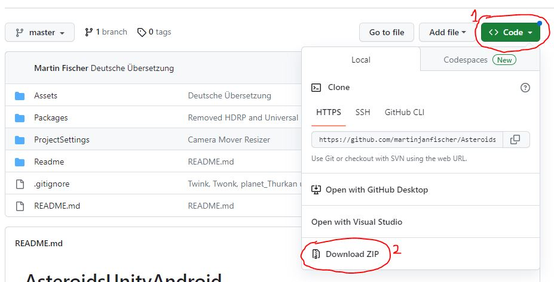
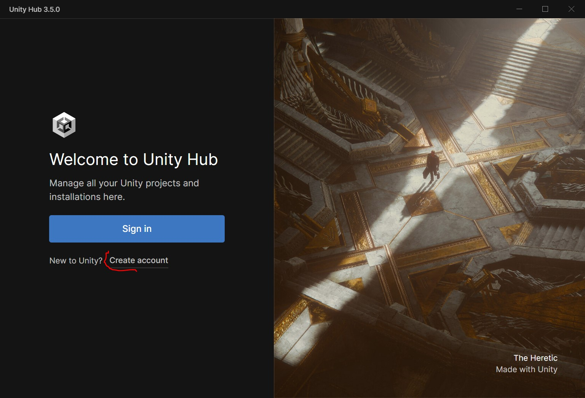
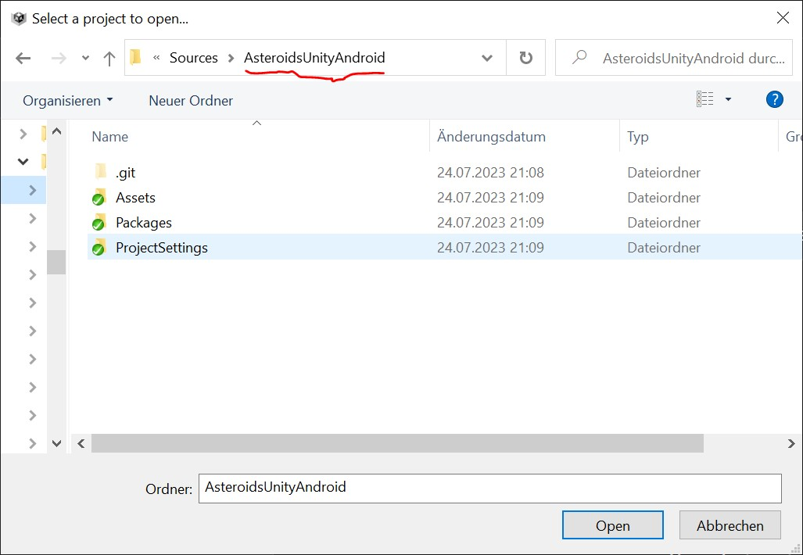
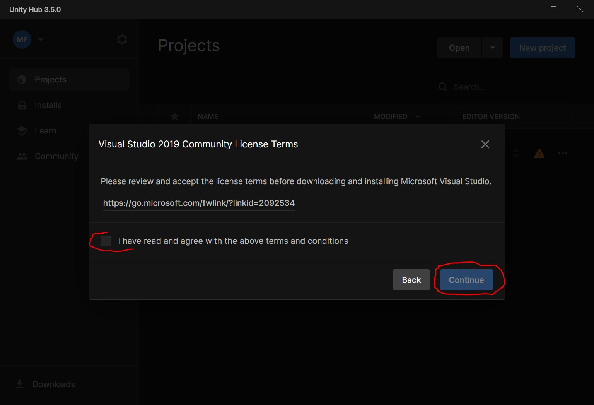
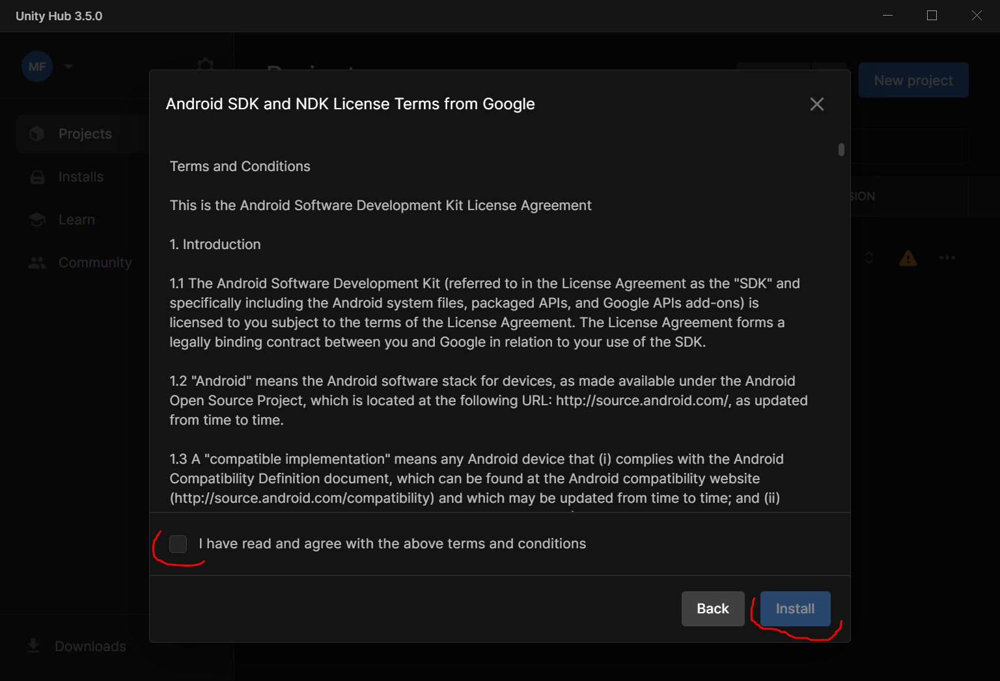
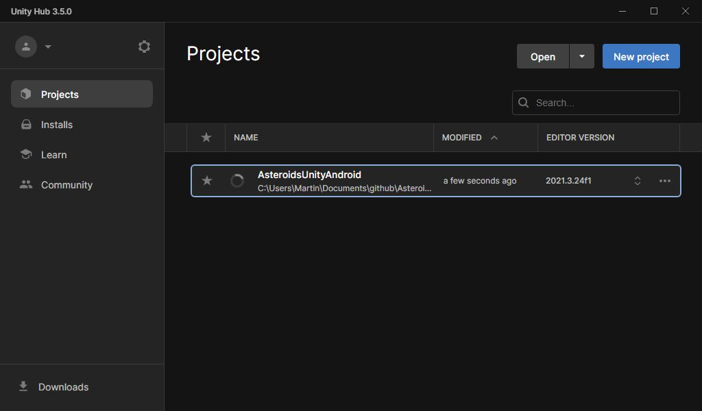
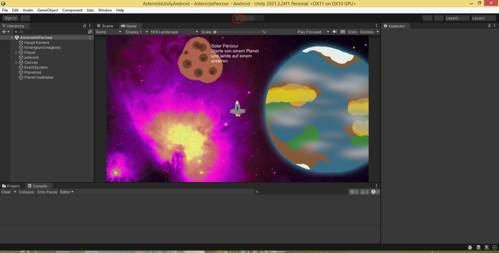
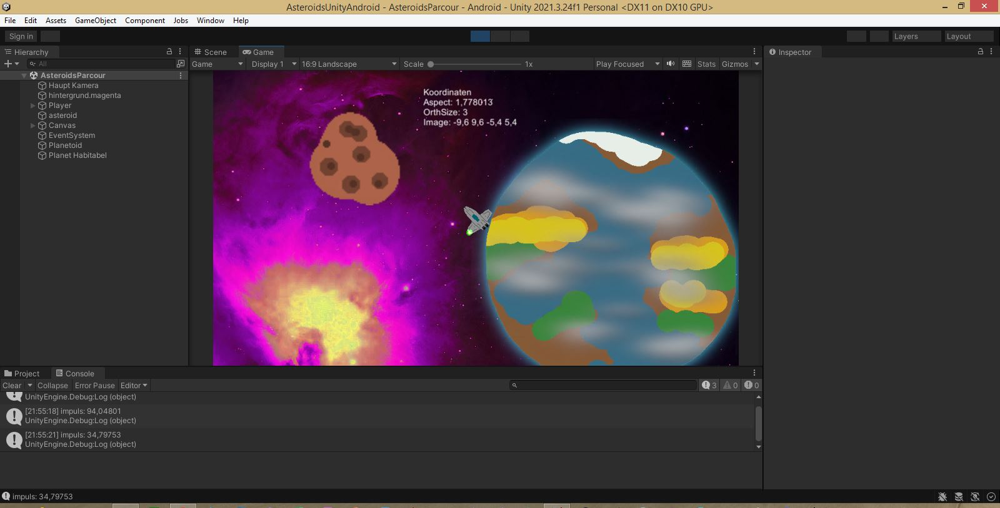
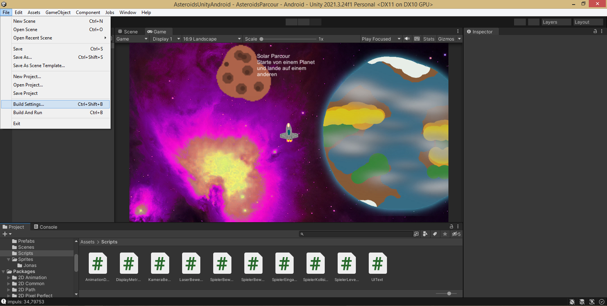
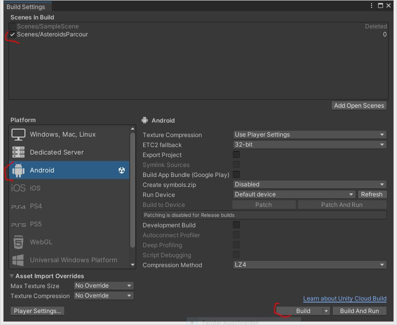

# EvFBW_Coding_2023_F
Programmierkurs für Fortgeschrittene 2023 für Jugendliche beim Evangelischen Familienbildungswerk

## Software
Wir arbeiten auf Windows 11 Computern und installieren dort
- das Textbearbeitungs Programm __Notepad++__ von
[notepad-plus-plus.org](https://notepad-plus-plus.org/downloads/)
- das Bildbearbeitungs Programm __The Gimp__ von
[www.gimp.org](https://www.gimp.org/)
- die Audio Software __Audacity__ von
[www.audacityteam.org](https://www.audacityteam.org/download/windows/)

### Für die Python Programmierer
- das __Python__ Übersetzer Programm von
[www.python.org](https://www.python.org/downloads/)
- die Community Version der Entwicklungsumgebung __PyCharm__ von
[www.jetbrains.com](https://www.jetbrains.com/pycharm/download/#section=windows)

### Für die Minecraft Mod Programmierer
- die Community Version der Entwicklungsumgebung __IntelliJ__ von
[www.jetbrains.com](https://www.jetbrains.com/de-de/idea/download/?section=windows)

### Für die Unity Programmierer
Seht dazu die Beschreibung des Spiels "Solar Parcour" in dem folgenden Abschnitt weiter unten.

## Solar Parcour
Das ist ein Spiel was ich für den Programmierkurs
beim Evangelischen Familienbildungswerk vorbereitet habe.
Es ist mit Absicht unfertig 
und kann von den teilnehmenden Kindern
beliebig erweitert werden.

Die teilnehmenden Kinder können das Spiel bequem 
auf ihr eigenes Android Smartphone installieren,
sodass sie es zu Hause oder unterwegs spielen 
und sogar ihren Familien und Freunden zeigen können.

Wenn ihr dieses Projekt zu Hause auf den eigenen Computer
herunterladen und bearbeiten möchtet
müsst ihr die folgenden Schritte befolgen.

1. Zuerst solltet ihr dieses Projekt als Zip Archiv herunterladen. Klickt auf den grünen Knopf mit der Aufschrift "Code" und dann auf den Menüeintrag "Download ZIP". Lasst Euch beim Öffnen dieser ZIP Datei von Euren Eltern helfen.
https://github.com/martinjanfischer/EvFBW_Coding_2023_F.git

2. Danach solltet ihr das Programm Unity Hub herunterladen und installieren.
Klickt entweder auf die Adresse
https://unity.com/download
oder direkt auf die Adresse
https://public-cdn.cloud.unity3d.com/hub/prod/UnityHubSetup.exe
.
Es kann sein, dass Windows Probleme bei der Installation von Unity Hub macht,
weil das Programm nicht über den Microsoft Store installiert wird.
Prüft daher in dem Programm Einstellungen, Apps und Features 
dass ihr auch Programme installieren dürft, die nicht über den Microsoft Store angeboten werden.

3. Ihr müsst ein Konto beim Unity anlegen.
Bei diesem Schritt könnt ihr Euch von Euren Eltern helfen lassen.

4. In dem Unity Hub Fenster klickt ihr auf der linken Seite auf "Projects"

5. In dem Unity Hub Fenster klickt ihr auf der rechten Seite auf den Knopf "Open"

6. In dem Verzeichnis-Auswahl-Fenster wechselt ihr in das Verzeichnis, das ihr nach dem Öffnen des ZIP Archivs (siehe Schritt 1) angelegt habt und klickt dann auf den Knopf "Open".

7. Unity HUB empfiehlt Euch einen Unity Editor zu installieren.
Es ist super wichtig die "Missing Version 2021.3.24f1 LTS" zu installieren.
Bitte wählt keine andere Version aus.
Klickt dann auf den Knopf mit der Aufschrift "Install Version 2021.3.24f1".

8. Das nächste Unity HUB Fenster fragt Euch
welche Module installiert werden sollen.
Unbedingt solltet ihr "Microsoft Visual Studio Community 2019" auswählen.
Wenn Ihr das Spiel auch auf Eurem Android Smartphone installieren möchtet,
dann solltet Ihr auch "Android Build Support",
"OpenJDK", und "Android SDK & NDK Tools" installieren.
Klickt auf den Knopf mit der Aufschrift "Continue".

9. Ihr müsst dann noch die Lizenzvereinbahrungen
für die Benutzung von Visual Studio 2019 Community akzeptieren
bevor ihr auf den Knopf mit der Aufschrift "Continue" klickt.

10. Zuletzt müsst ihr dann noch die Lizenzvereinbahrungen
für die Benutzung vom Android SDK und NDK akzeptieren.
Ihr klickt auf den Knopf mit der Aufschrift "Install"
und die sehr lange Installation beginnt.

11. Nachdem die Installation fertig geworden ist,
könnt Ihr nun das Spielprojekt im Unity HUB Fenster öffnen,
wenn Ihr zuerst den Knopf "Projects" auf der linken Seite anklickt
und dann in der Mitte des Fensters das Spielprojekt anklickt.
Es wird ein Kreis angezeigt, dass den Ladevorgang anzeigt.
Es kommt dann ein Fortschrittsbalken 
und dann der Ladebildschirm des Unity Editor Programms.

12. Das Unity Editor Fenster sollte ungefähr so wie im Bild aussehen.
Ihr könnt das Spiel auch sofort spielen indem ihr auf den Knopf mit dem Dreieck klickt.
Ihr verlasst das Spiel auch wieder über denselben Knopft.

13. Wenn Ihr das APK Installationspaket für Euer Android Smartphone erstellen möchtet,
dann klickt auf das Menü "File, Build Settings...".

14. In dem nächsten Fenster wählt Ihr zuerst oben links eine Szene aus
die Ihr in dem Installationspaket haben wollt,
dann wählt ihr links die Plattform "Android" aus,
und klickt dann zuletzt unten rechts auf den Knopf "Build".

15. In dem nächsten Fenster wählt Ihr ein Verzeichnis aus,
in dem die Datei "SolarParcour.apk" erzeugt werden soll,
dann klickt Ihr auf den Knopf "Speichern".
Dann erscheint ein Fortschrittsbalken und Ihr müsst wieder etwas warten.

20. Zum Schluss schliesst Ihr Euer Android Smartphone 
an den Computer an, kopiert die Datei "SolarParcour.apk" auf Euer Smartphone,
und auf dem Smartphone könnt Ihr dann das Paket installieren.
